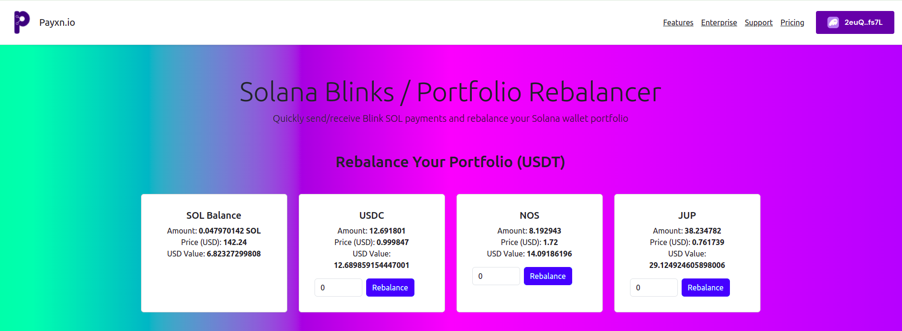
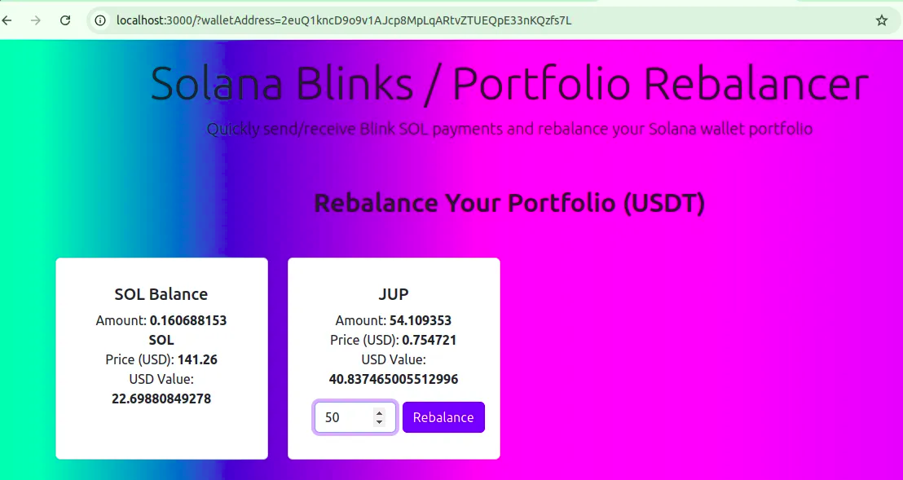
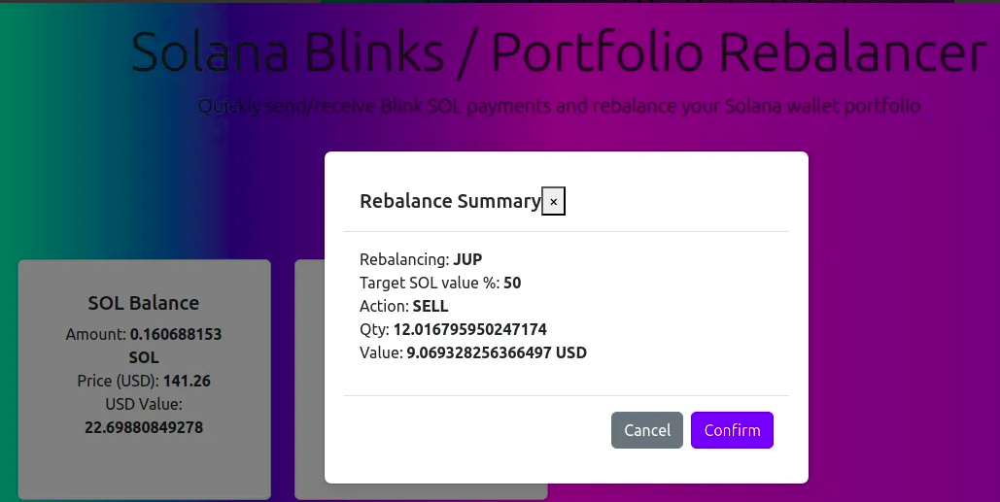
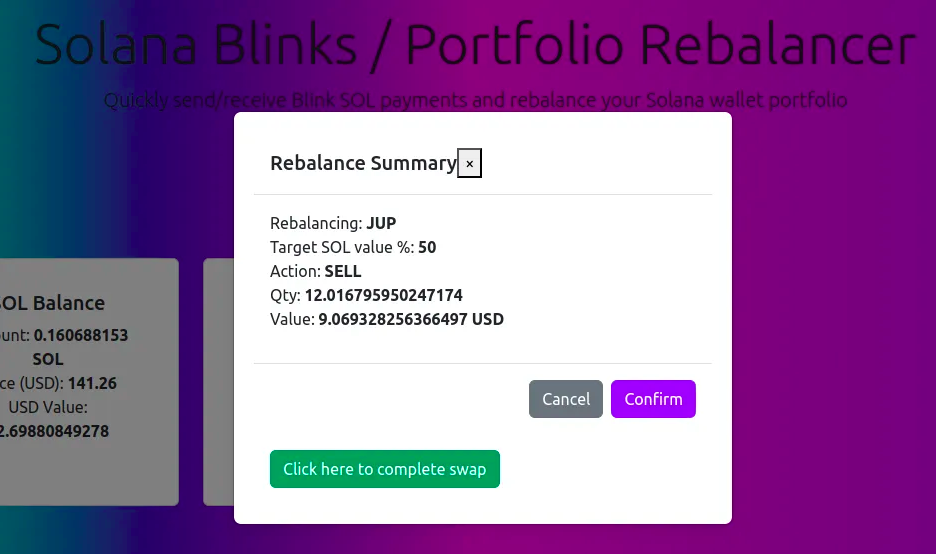
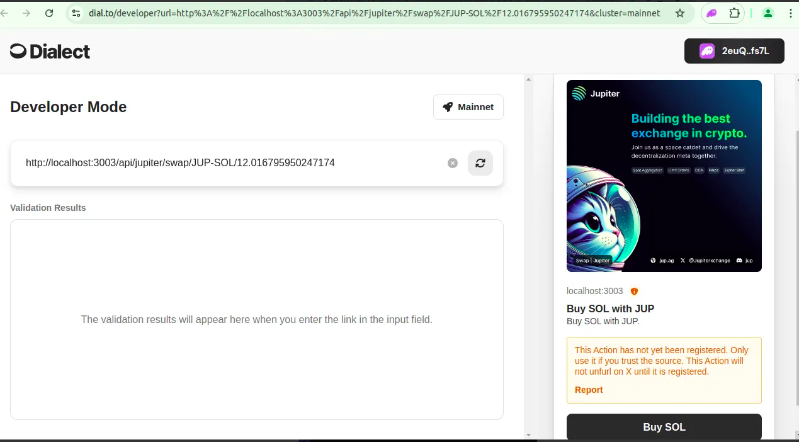
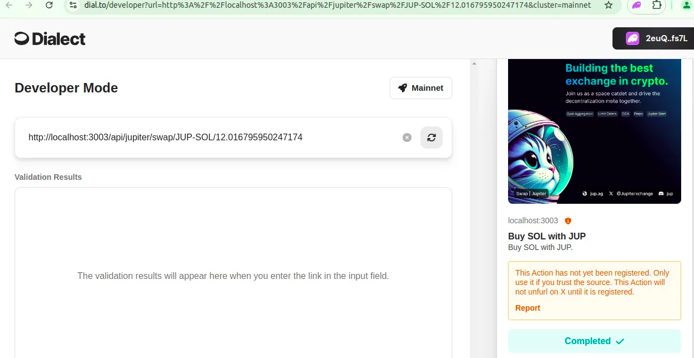
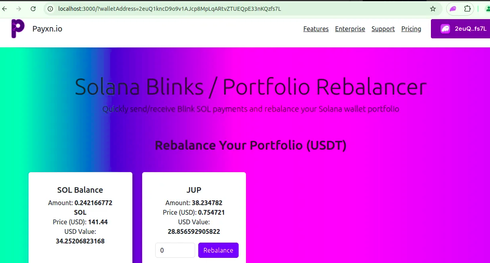

# Solana Portfolio Rebalancer





A user-friendly web application that helps you easily maintain your Solana-based token portfolio at your preferred ratios, automating the process of buying or selling tokens to rebalance your portfolio with minimal fees.

------

## Table of Contents

- [Overview](#overview)
- [Features](#features)
- [Live Demo](#live-demo)
- [Getting Started](#getting-started)
- [How It Works](#how-it-works)
- [Technology Stack](#technology-stack)
- [Project Structure](#project-structure)
- [Contributing](#contributing)
- [License](#license)

------

## Overview

Managing a diverse portfolio of tokens on Solana can be time-consuming and complex, especially when you need to maintain specific token ratios (e.g., 90% SOL and 10% JUP). This web app simplifies the entire process, allowing users to connect their Solana wallet, view token balances, and automatically rebalance their portfolio by buying or selling tokens to maintain their desired allocation.

The app calculates token quantities, prices, and actions needed (buy/sell) based on real-time token prices, all in the fast and low-fee environment of the Solana blockchain.

------

## Features

- **Wallet Integration**: Seamless connection to Solana wallets such as Phantom to fetch balances and token holdings.
- **Real-Time Rebalancing**: Automatically calculate buy/sell quantities based on current token prices and your preferred portfolio distribution.
- **Token Support**: Supports multiple Solana-based tokens like SOL, JUP, USDT, WBTC, PYTH, and more.
- **Low Fees**: Solana's high-speed transactions with minimal fees make rebalancing both cost-effective and fast.
- **User-Friendly**: Simple UI for users to easily connect wallets, review token holdings, and rebalance portfolios.
- **One-Click Rebalance**: Generate swap links that allow users to execute swaps without manually calculating amounts.

------

## Portfolio Rebalancer: How It Works


### Token Listing and choosing Rebalancing %age


The Portfolio Rebalancer displays a comprehensive list of tokens in your wallet, along with their quantities and values in USD. For each token, you can easily manage your portfolio by specifying the desired percentage of your total portfolio that should be allocated to Solana (SOL) compared to that token.

For example, if you choose 30%, this means that out of the combined value of your SOL and the selected token, 30% should be allocated to SOL, and the remaining 70% to the token.

If the current token value exceeds your specified percentage, the rebalancer will automatically sell the token to increase your SOL holdings. Conversely, if the token value is lower than your target percentage, the rebalancer will use your SOL to purchase more of the token to meet your desired allocation. This allows you to maintain a balanced portfolio in line with your preferences, ensuring efficient and hassle-free portfolio management.




### Review the Rebalancing pop up


Once you've specified the desired percentage for your portfolio allocation, a confirmation popup will appear showing the exact amount of the selected token that will be **bought** or **sold**. This popup provides a clear summary of the rebalancing action, including the token quantity and value in USD. You can then review the details and confirm the rebalancing action with a single click. This ensures that the process is transparent and that you are fully informed before proceeding with the trade.





### Swap Link generation

After confirming the rebalancing action, the system will generate a unique swap link. By pressing the **Confirm** button, you'll receive a link that directs you to complete the token swap. This link ensures a secure and smooth transaction, allowing you to easily swap tokens on the Solana network. All you need to do is click the link to finalize the swap, and the portfolio rebalancer will handle the rest.





### Unfurl the swap to jupiter swap

This now takes you to Jupiter swap link unfurled on Dialect for now.
Then you can click on the Buy SOL or Buy Token button.





### Solana Wallet confirmation Signature


### Confirmation from Jupiter swap




You can now refresh your screen to see the new balances.





The project is deployed on a live environment for demonstration purposes.

🔗 [Live Demo Link](https://your-live-demo-url.com)

------

## Getting Started

### Prerequisites

To run this project locally, you need to have:

- [Node.js](https://nodejs.org/)
- [NPM](https://npmjs.com/) or [Yarn](https://yarnpkg.com/)
- A Solana wallet (e.g., [Phantom](https://phantom.app/))

### Installation

1. Clone the repository:

   ```
   bashCopy codegit clone https://github.com/your-username/solana-portfolio-rebalancer.git
   cd solana-portfolio-rebalancer
   ```

2. Install the dependencies:

   ```
   bashCopy codenpm install
   # or
   yarn install
   ```

3. Create a `.env` file and add your Solana RPC URL and other configurations:

   ```
   bash
   
   
   Copy code
   NEXT_PUBLIC_SOLANA_RPC_URL=https://api.mainnet-beta.solana.com
   ```

4. Start the local development server:

   ```
   bashCopy codenpm run dev
   # or
   yarn dev
   ```

5. Open your browser and go to `http://localhost:3000`.

------

## How It Works

### 1. **Connect Wallet**

Users can connect their Solana wallet using Phantom or other supported wallet providers. The app fetches the wallet's token balances in real time, including SOL and any associated SPL tokens (e.g., USDT, JUP).

### 2. **Token Balances and Portfolio**

Once the wallet is connected, the app displays the current balance and value of each token in USD. Users can review their portfolio and determine which token to rebalance.

### 3. **Set Rebalance Targets**

Users can set their preferred allocation percentages for each token. For example, if you want to maintain 90% SOL and 10% JUP, you simply input these values into the app.

### 4. **Rebalance Calculation**

The app automatically calculates the amount of each token that needs to be bought or sold to achieve the target allocation. The quantities are computed based on live token prices fetched from CoinGecko.

### 5. **Execute Swaps**

Once the rebalance is calculated, the app generates a link for users to complete the swap. The swaps are facilitated using Solana's fast and inexpensive transaction system, and users can execute them with a single click.

------

## Technology Stack

- **Frontend**:
  - [React](https://reactjs.org/): For building the user interface.
  - [Next.js](https://nextjs.org/): A React framework for server-side rendering and API routes.
  - [Bootstrap](https://getbootstrap.com/): For styling and modal functionality.
- **Solana Blockchain**:
  - Solana Web3.js: For interacting with Solana blockchain, fetching wallet balances, and performing token operations.
  - [Solana Wallet Adapter](https://github.com/solana-labs/wallet-adapter): For connecting with wallets like Phantom.
- **Data**:
  - CoinGecko API: Used to fetch real-time token prices for SOL and SPL tokens.
- **Backend**:
  - No traditional backend is required, as Next.js API routes handle server-side logic like fetching token balances and prices.

------

## Project Structure

```
plaintextCopy code├── /components           # Reusable UI components
├── /pages                # Next.js pages
│   ├── /index.tsx        # Main page of the portfolio rebalancer
│   ├── /api              # API routes to handle data fetching
├── /styles               # CSS and Bootstrap overrides
├── /utils                # Utility functions like fetching prices and balances
├── /public               # Static assets
└── /portfolioIndex.ts    # Core logic for portfolio balancing and token price fetching
```

------

## Contributing

We welcome contributions to improve this project!

1. Fork the repo
2. Create a feature branch
3. Commit your changes
4. Push to the branch
5. Submit a Pull Request

------

## License

This project is licensed under the MIT License. See the LICENSE file for details.

------

This README provides a full overview of the project, explaining its purpose, how to use it, and the technologies involved. Let me know if you need further customizations!
